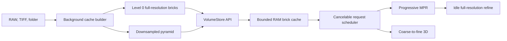

# Dragonfly-like Large Volume Engine

## Cam kết và giới hạn
- Chất lượng MPR cuối cùng giữ nguyên: cùng voxel `level-0`, dtype, window/level, hướng ảnh và nội suy hiện tại. Khi kéo slice/crosshair, dùng mip thấp tạm thời; khi dừng sẽ hủy frame cũ và refine về full-resolution.
- Không thể cam kết ngay “mượt y hệt Dragonfly” vì Dragonfly là engine native đã tối ưu nhiều năm. Mục tiêu nghiệm thu thực tế trên volume chuẩn 15 GB: UI không block, tương tác MPR đạt tối thiểu 20–30 FPS/p95 dưới 50 ms, không tạo full-volume copy, và ảnh refine phải pixel-equivalent với pipeline hiện tại.

## Kiến trúc đích

## 1. Đo baseline và đặt performance gates
- Thêm timing/memory counters có thể bật/tắt quanh load, lấy slice, compose overlay, VTK upload và `Render()` trong [inno3d/features/viewer/volume_io.py](inno3d/features/viewer/volume_io.py), [inno3d/features/viewer/mpr_render.py](inno3d/features/viewer/mpr_render.py), [inno3d/features/viewer/crosshair.py](inno3d/features/viewer/crosshair.py) và [inno3d/features/viewer/volume_3d.py](inno3d/features/viewer/volume_3d.py).
- Ghi p50/p95 frame latency, RSS, VRAM/shared GPU memory, số request bị hủy và cache hit rate cho dataset 15 GB; dùng kết quả này làm điều kiện pass/fail thay vì tuyên bố cảm tính “giống Dragonfly”.

## 2. Tạo tầng lưu trữ out-of-core và cache đa độ phân giải
- Thêm `VolumeStore` trong `inno3d/core/volume_store.py` với metadata (`shape`, `dtype`, `spacing`, range) và API bất đồng bộ `get_slice`, `get_roi`, `get_bricks`, `get_level`; tuyệt đối không cung cấp implicit `__array__` vì có thể vô tình materialize 15 GB.
- Thêm backend cho RAW memmap và cache chunked local trong `inno3d/infra/volume_cache.py`; cache được định danh bằng path, size, mtime, import metadata và schema version, có lock/atomic publish để không dùng cache dở dang.
- Thêm builder chạy nền trong `inno3d/services/volume_pyramid.py`: ghi level-0 lossless, tạo pyramid 2x theo từng level, lưu min/max metadata và cho phép Viewer sử dụng level thấp ngay khi các brick đầu tiên sẵn sàng. Dùng chunk 3D có benchmark thực tế thay vì hard-code một kích thước duy nhất.
- Giới hạn RAM cache theo ngân sách/LRU, prefetch các slice kế tiếp theo hướng và vận tốc kéo; hủy request cũ khi crosshair đổi nhanh.

## 3. Chuyển Viewer từ NumPy monolith sang `VolumeStore`
- Trong [inno3d/tabs/viewer.py](inno3d/tabs/viewer.py), thay ownership trực tiếp `self.volume_data` bằng `self.volume_store`; giữ metadata adapter ngắn hạn cho `shape/dtype` nhưng migrate các hot path, không để fallback load toàn volume.
- Refactor `LoadVolumeThread` ở [inno3d/core/view_support.py](inno3d/core/view_support.py) và orchestration ở [inno3d/features/viewer/volume_io.py](inno3d/features/viewer/volume_io.py): mở cache hợp lệ gần như tức thời; cache miss thì build nền/progressive; bỏ RAW `memmap -> np.array(copy=True)` và không emit dense array 15 GB sang GUI thread.
- Các workflow cần toàn volume như alignment/segmentation phải gọi API rõ ràng (`get_roi` hoặc explicit materialization có cảnh báo); giai đoạn này chỉ migrate Viewer, Teaching/Online tiếp tục adapter cũ để giảm phạm vi rủi ro.

## 4. Progressive MPR nhưng giữ chất lượng cuối cùng
- Refactor [inno3d/features/viewer/mpr_render.py](inno3d/features/viewer/mpr_render.py) thành request pipeline có generation ID: trong drag chọn mip theo kích thước viewport/zoom, hiển thị kết quả mới nhất; sau 80–120 ms idle yêu cầu level-0 và chỉ apply nếu generation còn hợp lệ.
- Giữ persistent `vtkImageData`, actor, ruler, crosshair và overlay; cập nhật buffer thay vì `RemoveViewProp`/rebuild. Dùng shallow VTK binding với NumPy reference được pin trong cache, double-buffer để không sửa vùng nhớ đang render.
- Trong [inno3d/features/viewer/crosshair.py](inno3d/features/viewer/crosshair.py), [inno3d/features/viewer/mpr_input.py](inno3d/features/viewer/mpr_input.py) và [inno3d/features/viewer/mpr_nav.py](inno3d/features/viewer/mpr_nav.py), coalesce mouse/slice events theo frame clock, debounce 3D render, ưu tiên pane đang thao tác và bỏ kết quả stale.
- Overlay/mask cũng được đọc theo slice/brick tương ứng; không bake/copy toàn mask volume chỉ để hiển thị MPR.

## 5. 3D coarse-to-fine và VRAM có ngân sách
- Trong [inno3d/features/viewer/volume_3d.py](inno3d/features/viewer/volume_3d.py), bỏ đường `transpose -> flatten -> deep=True` cho full volume. Chọn mip 3D vừa ngân sách VRAM ngay từ đầu, giữ VTK/GPU object qua thay đổi W/L và chỉ cập nhật transfer function.
- Khi rotate/zoom dùng mip coarse + sample distance lớn; sau idle refine lên level cao hơn nếu VRAM cho phép. Không tự đặt giới hạn 28 GB cố định; tính ngân sách từ GPU khả dụng và chừa headroom cho framebuffer/mask/UI.
- Nếu volume level-0 vượt ngân sách, MPR vẫn full-resolution nhưng 3D không được phép upload toàn bộ; hiển thị rõ level đang render.

## 6. Kiểm thử, rollout và tiêu chí nghiệm thu
- Thêm unit tests cho cache key/invalidation, pyramid dimensions, orientation, endian/dtype, request cancellation và LRU tại `tests/unit/test_volume_store.py` và `tests/unit/test_volume_pyramid.py`.
- Thêm golden tests so sánh axial/coronal/sagittal level-0 mới với `render_slice` cũ: shape, orientation, voxel values và ảnh W/L phải khớp; test rằng frame refine cuối không phải mip preview.
- Thêm integration benchmark `tests/performance/test_large_volume_viewer.py` với synthetic/memmap volume, đo p95 latency và peak RSS; benchmark 15 GB thật chạy thủ công trên máy đích.
- Rollout qua feature flag `large_volume_engine`: shadow-compare slice mới/cũ trên volume nhỏ, bật mặc định cho Viewer sau khi golden/performance gates đạt; rồi mới lập phase riêng để migrate Teaching và Online.

## Thứ tự giao hàng
1. Instrumentation + `VolumeStore`/cache builder.
2. Viewer load progressive + MPR level-0 parity.
3. MPR preview/refine, cancellation, persistent VTK buffers.
4. 3D mip/VRAM budgeting.
5. Benchmark 15 GB, sửa regression, bật mặc định.
6. Sau khi Viewer ổn định mới mở rộng sang Teaching/Online.