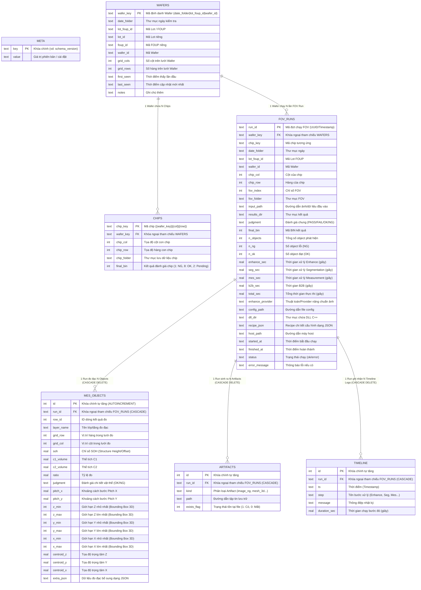

# Sơ đồ Cấu trúc Database `inspection.db`

Tài liệu này tổng hợp toàn bộ sơ đồ cấu trúc CSDL SQLite (`Inno3D_Data/inspection.db`) của dự án, bao gồm **Sơ đồ Thực thể Mối quan hệ (ERD)** và **Sơ đồ Luồng Dữ liệu (Data Flow)**.

---

## 1. Sơ đồ Thực thể Mối quan hệ (Entity-Relationship Diagram)

Sơ đồ dưới đây thể hiện tất cả 7 bảng trong Database cùng với các thuộc tính khóa chính (PK), khóa ngoại (FK) và mối quan hệ giữa chúng.



---

## 2. Sơ đồ Luồng Dữ liệu & Mối quan hệ Phân cấp (Hierarchy Data Flow)

Dưới đây là sơ đồ phân cấp dữ liệu từ mức **Wafer** xuống **Chip**, **FOV Run** và các dữ liệu đo đạc chi tiết:

```mermaid
flowchart TD
    subgraph LEVEL_1 [Cấp Wafer]
        W[WAFERS<br/><i>wafer_key = date|lot|wafer_id</i>]
    end

    subgraph LEVEL_2 [Cấp Chip & Lượt kiểm tra FOV]
        C[CHIPS<br/><i>chip_key = wafer_key|col|row</i>]
        R[FOV_RUNS<br/><i>run_id = unique_run_id</i>]
    end

    subgraph LEVEL_3 [Cấp Kết quả Đo đạc & Artifacts]
        M[MES_OBJECTS<br/><i>Chi tiết kích thước 3D / Centroid / Volumes</i>]
        A[ARTIFACTS<br/><i>File ảnh NG / File Mesh 3D / Raw Data</i>]
        T[TIMELINE<br/><i>Lịch sử thời gian từng step xử lý</i>]
    end

    W -->|1 : N| C
    W -->|1 : N| R
    R -.->|Thuộc Chip| C
    R -->|1 : N ON DELETE CASCADE| M
    R -->|1 : N ON DELETE CASCADE| A
    R -->|1 : N ON DELETE CASCADE| T

    style W fill:#1f77b4,color:#fff,stroke:#333,stroke-width:2px
    style C fill:#2ca02c,color:#fff,stroke:#333,stroke-width:2px
    style R fill:#ff7f0e,color:#fff,stroke:#333,stroke-width:2px
    style M fill:#d62728,color:#fff,stroke:#333,stroke-width:1px
    style A fill:#9467bd,color:#fff,stroke:#333,stroke-width:1px
    style T fill:#8c564b,color:#fff,stroke:#333,stroke-width:1px
```

---

## 3. Tóm tắt các Chỉ mục (Indexes) Tối ưu hóa truy vấn SQL

| Tên Index | Bảng áp dụng | Cột tạo Index | Mục đích |
| :--- | :--- | :--- | :--- |
| `idx_runs_wafer` | `fov_runs` | `wafer_key` | Tăng tốc tìm kiếm danh sách lượt chạy theo từng Wafer |
| `idx_runs_lot` | `fov_runs` | `lot_foup_id` | Tăng tốc lọc báo cáo theo Lot / FOUP ID |
| `idx_runs_finished` | `fov_runs` | `finished_at` | Tăng tốc truy vấn danh sách lượt chạy gần đây theo thời gian |
| `idx_mes_run` | `mes_objects` | `run_id` | Tăng tốc load danh sách vật thể đo đạc khi chọn 1 FOV Run |
| `idx_art_run` | `artifacts` | `run_id` | Tăng tốc load các file ảnh / model 3D tương ứng với 1 FOV Run |
