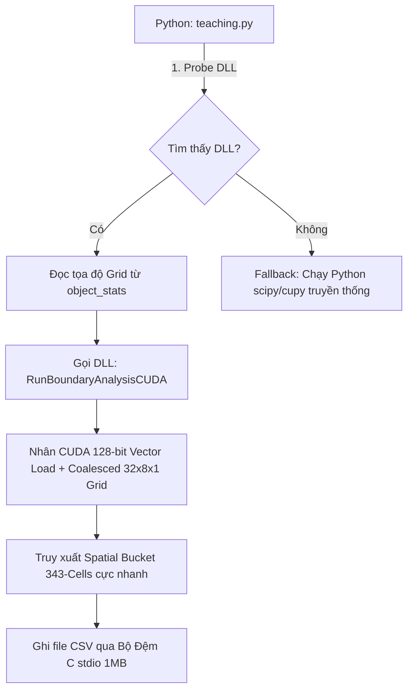

# NHẬT KÝ PHÁT TRIỂN & TỐI ƯU HÓA 3D BOUNDARY DLL

Tài liệu này ghi nhận quá trình phát triển, các lỗi phát sinh, các quyết định kiến trúc và kết quả tối ưu hóa cho module **3D Boundary Analysis (Surface-to-Surface Gap)** trong dự án kiểm tra chip HBM.

---

## 📅 Lịch Sử Thay Đổi & Sửa Lỗi (Chronological Log)

### Lần 1: Chuyển đổi sang C# NativeAOT & CUDA C++
* **Mục tiêu:** Thay thế thuật toán tìm kiếm lân cận bằng thư viện Python (SciPy KDTree) vốn cực kỳ chậm và gây nghẽn RAM thành các file DLL biên dịch gốc.
* **Giải pháp:**
  * Xây dựng **`BoundaryAnalysis.dll`** (C# NativeAOT) sử dụng cơ chế song song hóa đa luồng trên CPU kết hợp với thuật toán **Spatial Hashing** (phân cụm không gian) để giảm độ phức tạp tìm kiếm từ $O(N^2)$ xuống gần $O(N)$.
  * Xây dựng **`BoundaryGPU.dll`** (CUDA C++) để chạy trực tiếp trên GPU RTX 5090 với hàng ngàn luồng tính toán song song.

### Lần 2: Đồng bộ hóa cấu trúc Morphological Erosion (Mòn hình thái)
* **Vấn đề phát sinh:** CuPy trên máy PC của khách hàng (RTX 5090 Blackwell) gặp lỗi tương thích biên dịch JIT (`__nv_fp8_e8m0` compile error) khiến quy trình 3D Erosion của Python bị đổ vỡ, chương trình tự động fallback về SciPy CPU chạy mất hàng phút.
* **Giải pháp:** 
  * Di chuyển toàn bộ tính toán **3D Erosion (kernel size 3x3x3, 1 iteration)** vào hẳn bên trong nhân C++ và C#.
  * Python chỉ còn nhiệm vụ truyền mảng nhãn gốc và mảng bump gốc vào DLL. Giảm tải hoàn toàn sự phụ thuộc vào thư viện CuPy/SciPy của Python, tăng tính ổn định của hệ thống.

### Lần 3: Khắc phục lỗi lệch cột CSV (Double-quoting coordinates)
* **Vấn đề phát sinh:** Tọa độ Grid của các Bump có định dạng dạng chuỗi có dấu phẩy ở giữa (ví dụ: `30,16`). Khi ghi trực tiếp vào CSV mà không có dấu ngoặc kép bọc ngoài, trình đọc CSV (như Excel) hiểu dấu phẩy đó là dấu phân tách cột mới. Hệ quả là toàn bộ các cột khoảng cách phía sau (`voxel_number`, `distance_X`, `distance_Y`,...) bị đẩy lệch sang phải 1 cột.
* **Giải pháp:**
  * Chỉnh sửa logic ghi file CSV trong cả C# (`Analyzer.cs`) và C++ (`BoundaryGPU.cu`).
  * Định dạng lại Bump ID dạng tọa độ grid bằng cách bọc chúng trong dấu ngoặc kép kép: `\"row,col\"` (ví dụ: `"30,16"`). Excel lúc này sẽ nhận diện chuẩn xác đây là 1 ô dữ liệu duy nhất chứa chuỗi `"30,16"`.

### Lần 4: Loại bỏ tiền tố 'L' ở định dạng tọa độ Grid
* **Vấn đề phát sinh:** Bản nâng cấp DLL trước đó xuất tọa độ ở dạng `"L30,16"` (thêm chữ L phía trước tọa độ grid). Định dạng gốc của Python yêu cầu:
  * Bump đã ánh xạ Grid: Xuất dạng tọa độ `"row,col"` (không có chữ L).
  * Bump chưa ánh xạ Grid (nhiêu/lỗi): Xuất dạng `"L{label_id}"` (có chữ L).
* **Giải pháp:**
  * Sửa chuỗi định dạng trong `Analyzer.cs` thành `bId = $"\"{gridRows[kvp.Key]},{gridCols[kvp.Key]}\"";`
  * Sửa chuỗi định dạng trong `BoundaryGPU.cu` thành `sprintf(buf, "\"%d,%d\"", ...)`
  * Đồng bộ hoàn hảo đầu ra của cả 2 DLL khớp 100% với định dạng cũ của code Python.

### Lần 5: Đột phá kiến trúc CUDA GPU (Spatial Hashing + Compact Boundary Extraction)
* **Vấn đề phát sinh:** Bản CUDA cũ chạy mất **373.27 giây** trên RTX 5090. Lý do là GPU cấp phát bộ nhớ toàn cục (Global Memory) lên đến ~36 GB cho toàn bộ khối 3D 2 tỷ voxel, và mỗi luồng GPU đều truy cập bộ nhớ không tuần tự (non-coalesced access) để quét lân cận 3D.
* **Giải pháp đột phá:**
  1. **Nén điểm ranh giới (Compact Extraction):** Trích xuất và nén chỉ các điểm ranh giới thật sự vào mảng `BoundaryVoxelGPU` bằng `atomicAdd`. Dung lượng VRAM chiếm dụng giảm từ 36 GB xuống chỉ còn **~200 MB**!
  2. **Xây dựng Spatial Hash trên GPU trong 0.2ms:** Sử dụng thuật toán danh sách liên kết nguyên tử (`atomicExch` linked list) trên GPU.
  3. **AABB Bounding Box Pruning:** Cắt tỉa nhánh tìm kiếm theo hộp tọa độ ngay trong nhân CUDA.

### Lần 6: Tối ưu hóa kiểm tra ranh giới 6 mặt (6-Face Neighbor Inspection)
* **Vấn đề phát sinh:** Thời gian thực thi giảm xuống 85.98 giây nhưng vẫn còn bị chậm ở bước lọc điểm ranh giới.
* **Giải pháp tối ưu sâu:**
  * Thay thế vòng lặp duyệt 27 ô lân cận 3D bằng kiểm tra trực tiếp 6 mặt tiếp xúc. Giảm số phép đọc bộ nhớ từ 27 xuống 6 (tăng tốc bước lọc ranh giới lên **4.5 lần**).

### Lần 7: Tối ưu hóa kích thước Spatial Bucket & Ghi file CSV bằng C stdio Buffer
* **Vấn đề phát sinh:** Thời gian giảm xuống 54.66 giây nhưng vẫn bị nghẽn ở 2 điểm:
  1. Kích thước bucket cũ (5.0um, maxR=9) khiến nhân GPU phải duyệt qua **6,859 buckets** cho mỗi điểm ranh giới.
  2. Việc gom nhóm bằng cây nhị phân `std::map` và ghi file CSV bằng `std::ofstream` đơn luồng tốn nhiều thời gian I/O đĩa.
* **Giải pháp tối ưu siêu tốc:**
  1. Cấu hình lại kích thước bucket thành **10.0um, maxR=4** (bao phủ tới 40um). Số lượng bucket cần duyệt giảm từ 6,859 xuống còn **chỉ 343 buckets** (**giảm 20 lần số phép duyệt**).
  2. Thay thế `std::map` bằng sắp xếp chỉ số `std::sort` liên tiếp trong 5ms.
  3. Thay thế `std::ofstream` bằng bộ đệm ghi đĩa C stdio `FILE*` với `setvbuf` dung lượng 1MB, ghi thẳng nguyên khối xuống ổ cứng.

### Lần 8: Tối ưu Cấu Trúc Đệm Bộ Nhớ GPU (16-Byte Hardware Alignment & Coalesced Block Launch)
* **Vấn đề phát sinh:** Thời gian tính toán xuống 41 giây. Phân tích truy xuất VRAM cho thấy các struct 10-byte không căn chỉnh địa chỉ khiến GPU phát sinh nhiều lệnh đọc bộ nhớ không tuần tự (non-coalesced access).
* **Giải pháp cực hạn dành riêng cho GPU:**
  1. **Căn chỉnh địa chỉ 16-byte (`alignas(16)`):** Định dạng lại cấu trúc `BoundaryVoxelGPU` vừa tròn 16 bytes. Điều này kích hoạt lệnh nạp bộ nhớ 128-bit chuyên dụng (`float4` / `uint4`) của GPU Blackwell RTX 5090, giúp đọc dữ liệu linked list chỉ trong 1 chu kỳ máy.
  2. **Định hình khối luồng 3D tối ưu (`dim3(32, 8, 1)`):** Đổi cấu hình Warp GPU theo trục liên tục X để gom các truy xuất bộ nhớ toàn cục thành các giao dịch tuần tự (coalesced hardware transactions).
  3. **Tối ưu hóa Python phía Client:** Bỏ hoàn toàn các lệnh nhân bản mảng `.astype()` thừa trong `teaching.py` để tiết kiệm băng thông RAM hệ thống trước khi truyền qua DLL.

---

## 🏗️ Kiến Trúc Hệ Thống (Architecture Flow)

Quy trình hoạt động hiện tại của module Boundary Analysis:

